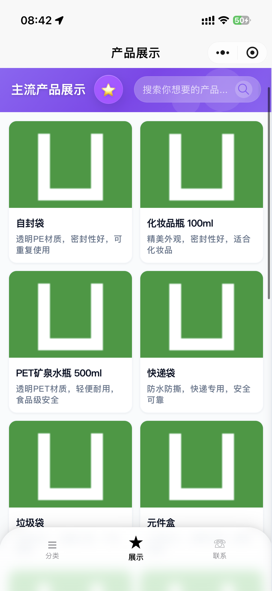
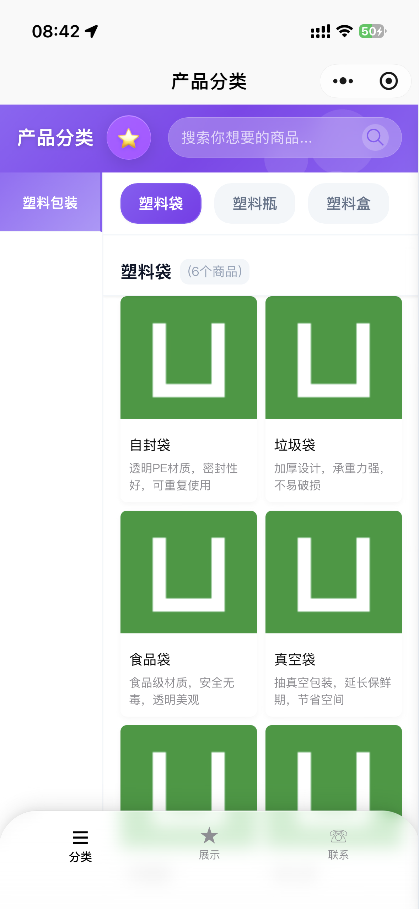
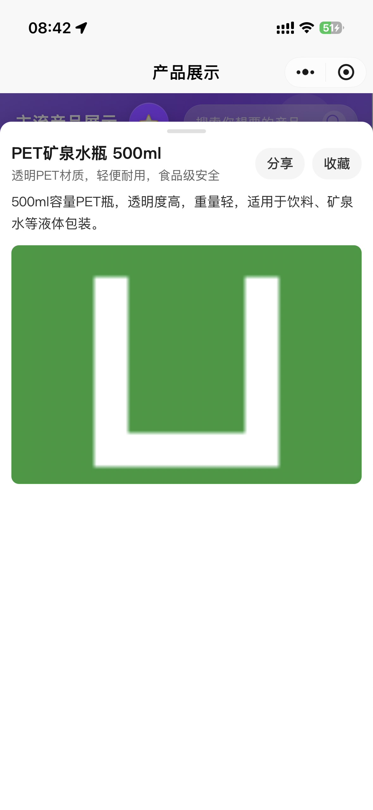
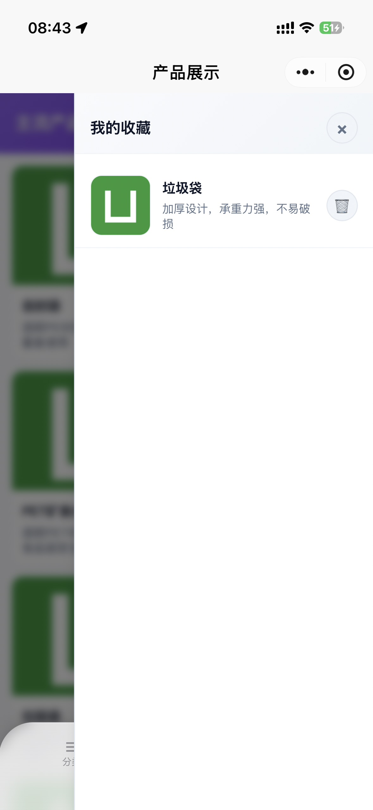

# 产品展示小程序

一个基于 uni-app 和 Vue 的现代化产品展示小程序。

## 📱 界面预览

<div align="center">
  
  
  
  
</div>

## 功能

- 产品分类展示
- 关键词搜索
- 商品收藏
- 联系方式页面

## 使用方法

1.  **安装依赖**
    ```bash
    npm install
    ```

3.  **配置联系信息和图片资源**
    - 将 `src/config.example.js` 复制一份并重命名为 `src/config.js`，然后填入真实的联系方式。
    ```bash
    cp src/config.example.js src/config.js
    ```
    
    - 将 `src/static/images/products/imageUrls.example.js` 复制一份并重命名为 `imageUrls.js`，然后填入实际的图片 URL。
    ```bash
    cp src/static/images/products/imageUrls.example.js src/static/images/products/imageUrls.js
    ```
    
    > **注意**：`imageUrls.js` 文件包含了所有产品图片的 URL 映射，每个变量名后都有中文注释说明对应的图片名称，方便识别和管理。此文件已被添加到 `.gitignore`，不会被提交到 Git 仓库中。

4.  **运行到微信开发者工具**
    ```bash
    npm run dev:mp-weixin
    ```
    然后在微信开发者工具中导入 `dist/dev/mp-weixin` 目录。

5.  **打包发布**
    ```bash
    npm run build:mp-weixin
    ```

## 📦 开发与发布流程

本项目包含两种主要工作模式，通过不同的命令启动：

### 开发模式

```bash
npm run dev:mp-weixin
```

-   **用途**：日常开发和调试。
-   **特点**：此模式会启动实时编译（热更新），代码修改后可立即在微信开发者工具中看到效果。
-   **目录**：开发者工具需导入 `dist/dev/mp-weixin` 目录。

### 发布模式

```bash
npm run build:mp-weixin
```

-   **用途**：完成开发后，准备提交审核或正式发布。
-   **特点**：此模式会对代码进行压缩和性能优化，生成体积最小的线上版本。
-   **上传**：执行完毕后，在微信开发者工具中点击“上传”，上传的代码包即为此模式生成的，位于 `dist/build/mp-weixin` 目录。
